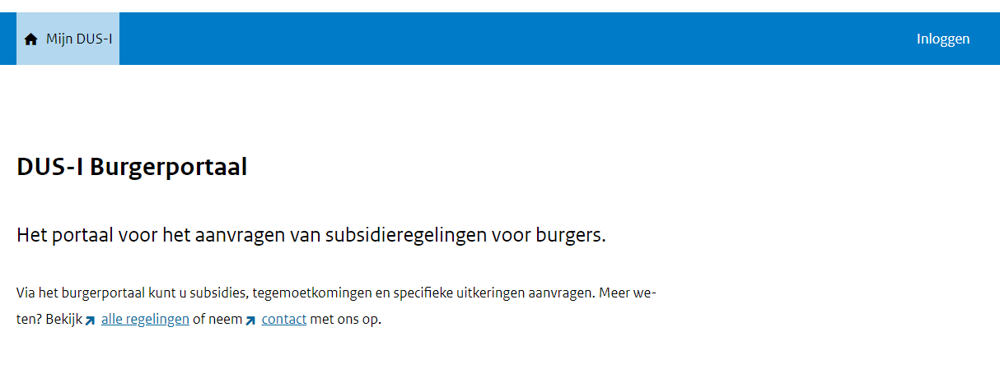

# Workflow aanvragen

Algemene handleiding voor het gebruik van DUS-I aanvragen.
Dit is een wijziging.

## beschrijving action 1

Dit is een beschrijving van action 1

## beschrijving action 2

Dit is een beschrijving van action 2

## beschrijving action 3

Dit is een beschrijving van action 3

## beschrijving action 4

Dit is een beschrijving van action 4

### subkop 1

Dit is onderdeel van action 4

### subkop 2

# test branching van Tim
Dit is onderdeel van action 4
