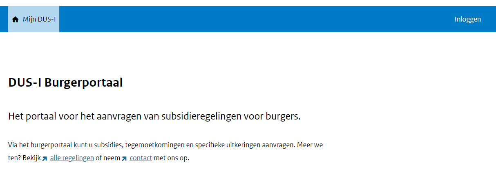

# Documentatie over het in- en uitloggen van Mijn DUS-I voor behandelaren

## Inloggen

Inloggen doet de gebruiker op basis van het geregistreerde e-mailadres en bijbehorend wachtwoord. 

Bij een correcte combinatie moet de gebruiker de code van diens gekozen 2 factor authenticatie middel invoeren.  

Zodra dit succesvol is gedaan wordt de gebruiker ingelogd.

## Uitloggen

Aan de rechterhand van de menubalk heeft de gebruiker de mogelijkheid om uit te loggen.  
Deze mogelijkheid zit in elk scherm.

## Eerste keer inloggen

De gebruiker ontvangt diens inloggegevens van DUS-I functioneel beheer. Daarop staan een initieel wachtwoord en een QR-code om de 2-factor authenticatie in te stellen.  

Met een verificatiecode wordt gecontroleerd op de koppeling succesvol is gelegd.  
Hierna kan de gebruiker inloggen met e-mailadres, wachtwoord, en 2FA verificatie.

## Wachtwoord vergeten

Op het inlogscherm heeft de gebruiker de mogelijkheid om diens wachtwoord opnieuw in te stellen.  
Daarvoor dient de gebruiker het e-mailadres op te geven waarna er een e-mail met instructies naar dat e-mailadres wordt gestuurd.  
Er wordt een bevestiging getoond dat de instructies zijn verzonden.

