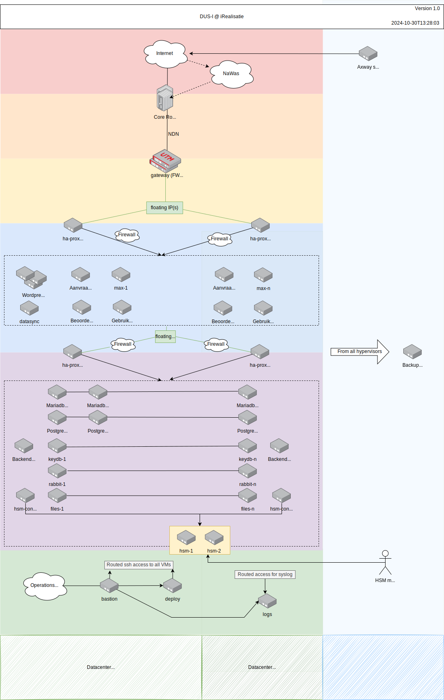

# 6. Infrastructuur

Onderstaande figuur toont de infrastructurele architectuur voor het DUS-I project:

## 6.1 Functionele beschrijving

Het DUS-I burgerportaal bestaat uit 3 portalen en een aantal ondersteunende diensten.

* het aanvraagportaal
* het beoordelingportaal
* het gebruikersbeheerportaal

## 6.2 Technische beschrijving

De portalen zijn gekoppeld aan het internet via een aantal switches en twee core routers (RC10/RC20). Alle onderdelen van de productie omgeving zijn redundant uitgevoerd met een active-active configuratie. Naast servers voor de
portalen draaien er ook servers t.b.v. extra dienstverlening zoals het synchroniseren van data en het inloggen van DigiD.

Via onze **gateway (FW set)** worden twee loadbalancers px11 en px12 (HA-proxy) bevraagd die een serie servers kan
aanroepen (worden bijgeschakeld naar behoefte). Het Nationaal Detectie Network (**NDN**) houd het internet verkeer aan
de buitenkant in de gaten.

Tussen de loadbalancers en de servers bevind zich een **firewall**.

De Front-end servers kunnen via de tweede set loadbalancers **px21** en **px222** (HA-proxy) de backend servers
benaderen. Hier zien we een serie servers (worden bijgeschakeld naar behoefte) die het volgende huisvesten:

* Mariadb – MySQL database servers, specifiek voor de WordPress installatie.
* Postgres – PostgreSQL database servers, specifiek voor het burgerportaal.
* Backend – Verwerken en opslaan van gegevens.
* KeyDB/Redis – Caching systeem voor key/value pairs. Wordt als drop-in replacement gebruikt voor Redis.
* RabbitMQ – Message queue servers voor de communicatie tussen front-end en back-end.
* HSM API – Hardware Security Module (HSM) Web API voor communicatie met de HSMs.
* Files – Data opslag voor bestanden (netwerk share).

## 6.3 Deployment en monitoring

**Operations VPN** is een virtual private network die door de afdeling Operations word gebruikt om het bij het beheer netwerk te kunnen komen. In het beheer netwerk bestaan meerdere diensten zoals de uitrol server(deploy) en bastion(jump-host) om bij de andere diensten te kunnen komen.

## 6.4 Tertiaire backup (Delft)

Dagelijks wordt er een backup gemaakt van de volledige servers / virtuele machines. Deze backup wordt
opgeslagen in een 3e datacenter.
